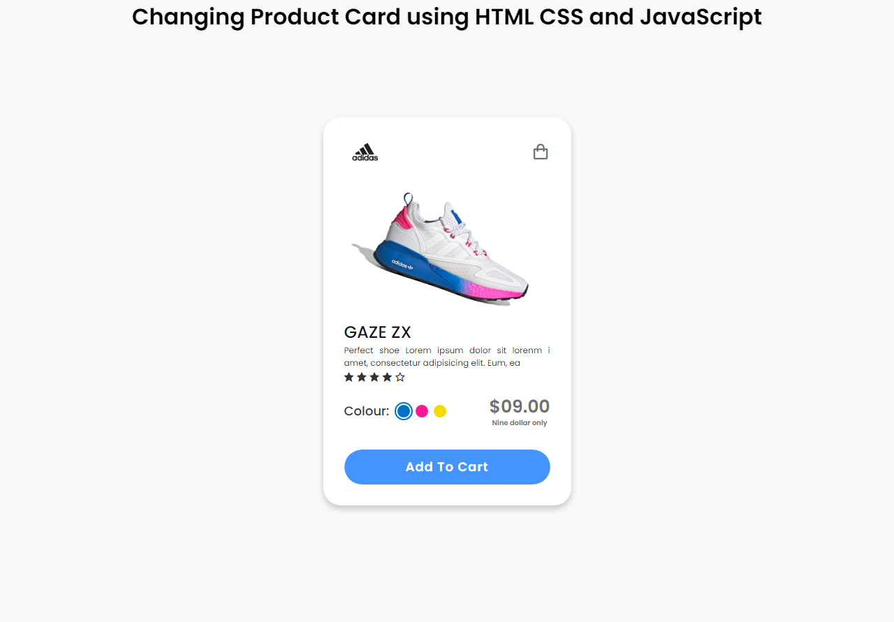

# Color Changing-Product-Card
 Color Changing Product Card using HTML CSS and JavaScript
  
 ## Demo:
<a target="_blank" href="https://codepen.io/danishlaeeq/pen/ExvbJPv">Demo on Codepen</a>
 
## Follow Me on:
 <a target="_blank" href="https://www.behance.net/danishlaeeq">Behance</a>
  
  <a target="_blank" href="https://dribbble.com/danishlaeeq">Dribbble</a>
  
  <a target="_blank" href="https://app.gumroad.com/danishlaeeq">GumRoad</a>
  
   <a target="_blank" href="https://www.pinterest.com/danish_laeeq/">Pinterest</a>
  
   <a target="_blank" href="https://www.instagram.com/_danishlaeeq/">Instagram</a>
  
   <a target="_blank" href="https://twitter.com/_danishlaeeq">Twitter</a>
  
   <a target="_blank" href="https://linkedin.com/in/danishlaeeq/">Linkedin</a>
  
<h2>Preview:</h2>

 

   <h2>Support My Work</h2>
    
   <a target="_blank" href="https://www.buymeacoffee.com/danishlaeeq">Buy Me a Coffe</a>
    
   <a target="_blank" href="https://www.patreon.com/danishlaeeq">Patreon</a>

